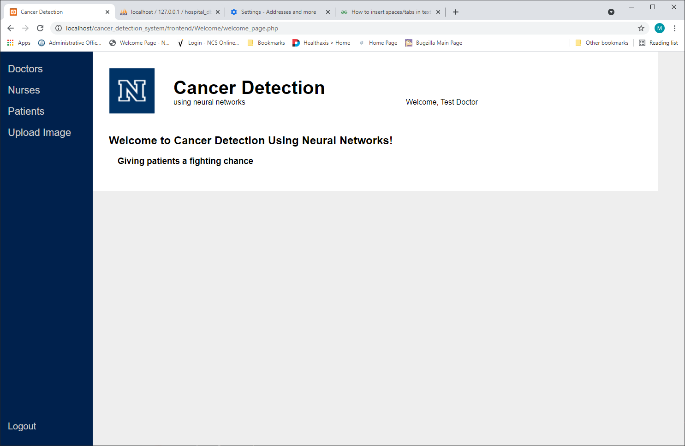
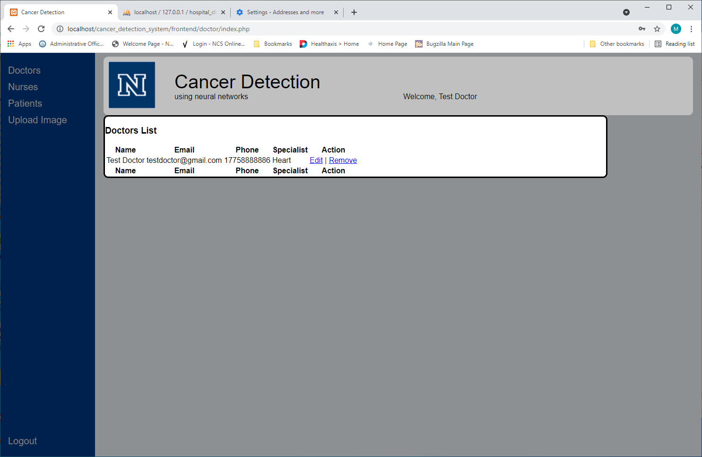
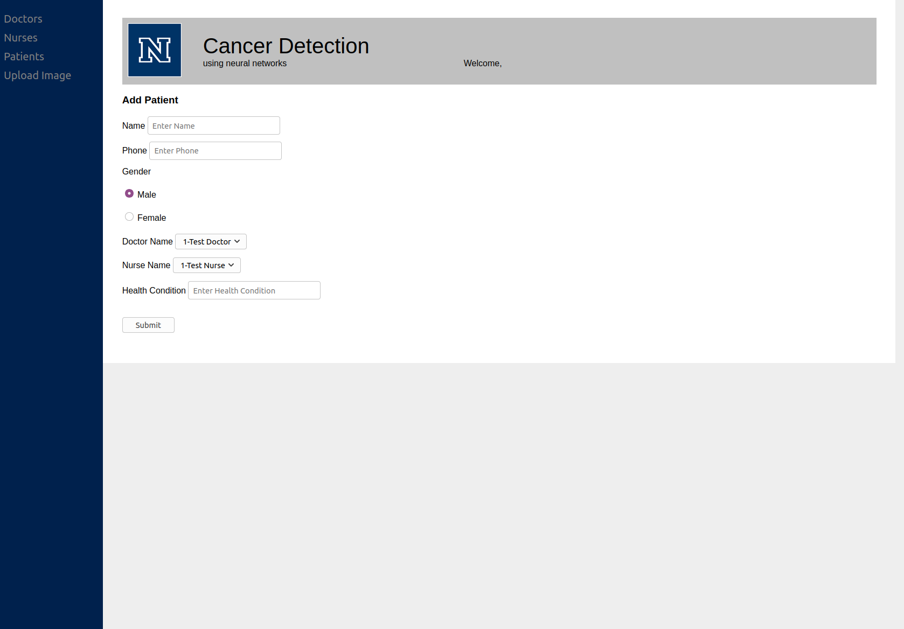
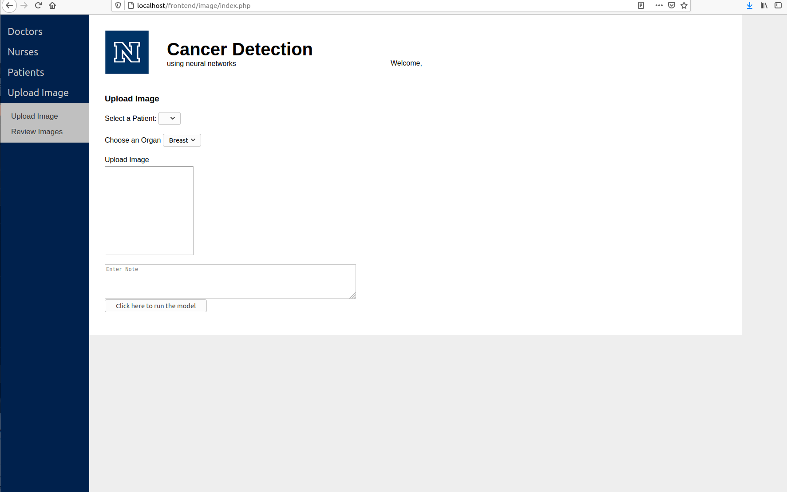

 # Product Name
> Cancer Detection using Deep Neural Networks

[![NPM Version][npm-image]][npm-url]
[![Build Status][travis-image]][travis-url]
[![Downloads Stats][npm-downloads]][npm-url]

This software is designed to be an interface for doctors to interface with medical classification networks for use in cancer diagnosis. The software currently is demostrated using a deep Neural network trained for classificaiton of breast cancer images.

This Software is as is. There may be more commit's in the future but is not to be expected. Any undetected bugs may not be fixed.



## Installation

> Install XAMPP for a localwebserver and navigate to the directory it is installed. [https://www.apachefriends.org/download.html]
> Clone the repo and place it inside the htdocs directory of XAMPP.
> Start XAMPP Control Panel and enable Apache and MySQl
> Type http://localhost/<..>/src/frontend/ into the browser. When <..> is an extra directories the repo may be in.

## Usage example

> The list of all doctors


> How to add a patient to the listing.


> Uploading an image, assigning it to a previously recorded patient and doctor and then you are able to run the Neural Network on it.


## Development setup

Describe how to install all development dependencies and how to run an automated test-suite of some kind. Potentially do this for multiple platforms.

```sh
sudo apt-get install python3
curl -sL https://deb.nodesource.com/setup_12.x | sudo -E bash -
sudo apt install nodejs
node --version
npm --version
```

```sh
npm install @tensorflow/tfjs
```
```sh
# Place at the top of the markup script
<script src="https://cdn.jsdelivr.net/npm/@tensorflow/tfjs@2.0.0/dist/tf.min.js">
```
## Release History

* 1.0
    * CHANGE: Final Release
* 0.2.1
    * CHANGE: Update docs (module code remains unchanged)
* 0.2.0
    * CHANGE: Added tensorflow.js interfacing 
* 0.1.1
    * FIX: Bug fixes
* 0.1.0
    * CHANGE: Interfaced a frontend with the trained network
* 0.0.1
    * CHANGE: Training of the Neural Network

## Meta

Shawn Ray - Asmodasis@gmail.com
Christian Greenman
Ethan Brown
Miguel Hernandez

Distributed under the MIT license. See ``LICENSE`` for more information.

[Github](https://github.com/Asmodasis)

## Contributing

1. Fork it (<https://github.com/Asmodasis/Cancer_detection_system/fork>)
2. Create your feature branch (`git checkout -b feature/fooBar`)
3. Commit your changes (`git commit -am 'Add some fooBar'`)
4. Push to the branch (`git push origin feature/fooBar`)
5. Create a new Pull Request

<!-- Markdown link & img dfn's -->
[npm-image]: https://img.shields.io/npm/v/datadog-metrics.svg?style=flat-square
[npm-url]: https://npmjs.org/package/datadog-metrics
[npm-downloads]: https://img.shields.io/npm/dm/datadog-metrics.svg?style=flat-square
[travis-image]: https://img.shields.io/travis/dbader/node-datadog-metrics/master.svg?style=flat-square
[travis-url]: https://travis-ci.org/dbader/node-datadog-metrics
